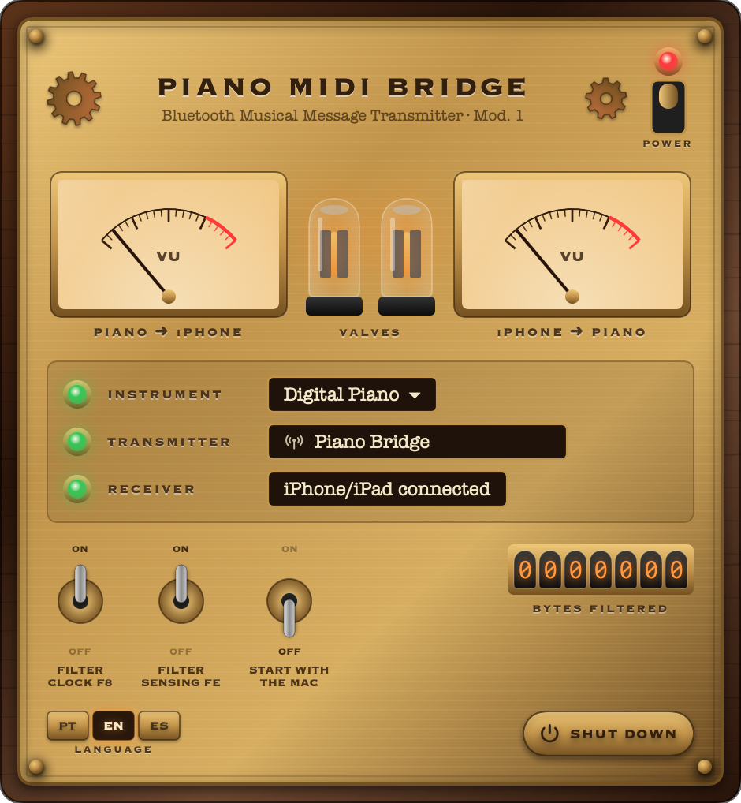

# 🎹 Piano MIDI Bridge

[Português](README.md) · **English** · [Español](README.es.md)

Use **Smart Pianist** (or any other iPhone/iPad MIDI app) with a digital piano connected **to your Mac via USB**, without buying a Bluetooth MIDI adapter (e.g. Yamaha UD-BT01).

Your Mac becomes the "Bluetooth MIDI adapter": the app advertises the Mac as a Bluetooth MIDI device (no macOS configuration window needed), the iPhone connects to it, and the app forwards MIDI messages between the iPhone and the USB piano in both directions (notes, pedals, commands and SysEx).

```
iPhone (Smart Pianist) ──Bluetooth MIDI──▶ Mac (Piano MIDI Bridge) ──USB──▶ Piano
```

<p align="center"></p>

Tested with a **Yamaha P-145BT** + Smart Pianist on iPhone. It should work with any class-compliant USB-MIDI instrument.

> Independent project, not affiliated with Yamaha. "Yamaha", "Smart Pianist" and "UD-BT01" are trademarks of their respective owners.

## Requirements

- macOS 14 (Sonoma) or later, Apple Silicon or Intel
- A Mac with Bluetooth
- Piano connected to the Mac with a USB cable (the piano's **USB TO HOST** port)

## Installation

1. Download `PianoMIDIBridge-x.y.z.dmg` from **[Releases](../../releases)**.
2. Open the DMG and drag **Piano MIDI Bridge** to **Applications**.
3. **First launch:** the app is not signed with an Apple certificate, so macOS will block it:
   - Open the app once (a warning appears) and dismiss the warning.
   - Go to **System Settings → Privacy & Security**, scroll to the bottom and click **Open Anyway**.
   - Or, from Terminal:
     ```bash
     xattr -dr com.apple.quarantine "/Applications/Piano MIDI Bridge.app"
     ```
4. The app panel appears when you open it. You can close it: the bridge keeps running from the 🎹 icon in the **menu bar** (the app does not stay in the Dock). To see the panel again, open the app again or click 🎹.

## How to use

1. Connect the piano to the Mac with the USB cable.
2. Open the app. The first time, macOS asks for **Bluetooth** permission: click **Allow**.
3. Check the panel: **INSTRUMENT** green with the piano's name and **TRANSMITTER** green with the advertised name (default `Piano Bridge`; click the name to change it).
4. On the iPhone, in **Smart Pianist**:
   1. Tap the connection icon (top left) → **Start Connection Wizard**.
   2. **Next** → **Bluetooth** → **Yes** → **Yes** → **Next**.
   3. Tap **Connect Bluetooth MIDI Device**, pick `Piano Bridge` (if the Mac was used as a Bluetooth MIDI device before, the iPhone may show its previous name) and tap ✓.
   4. **Next** → choose your piano from the list (e.g. `P-145BT`).
   - ⚠️ Don't pair from the iPhone's Settings → Bluetooth; connect **from inside the app**.
5. The **RECEIVER** lamp turns green and the instrument icon turns green in Smart Pianist. Done!

Next time, just open the app on the Mac: Smart Pianist reconnects by itself.

### The panel

| Control | What it does |
|---|---|
| **POWER** switch (top right) | Turns the bridge on/off |
| **VU meters** | MIDI traffic in each direction: piano → iPhone and iPhone → piano |
| **Valves** | Light up while the bridge is on and glow brighter with traffic |
| **INSTRUMENT** | Chooses the USB piano (click its name) |
| **TRANSMITTER** | Name the iPhone sees (click to edit). Green lamp = advertising; red = Mac Bluetooth off or not allowed |
| **RECEIVER** | Shows the iPhone/iPad connected via Bluetooth |
| **FILTER CLOCK F8** | Doesn't send the piano's MIDI clock to the iPhone. Recommended: clock produces dozens of messages per second and can drop the Bluetooth connection |
| **FILTER SENSING FE** | Doesn't send the piano's active sensing ("I'm alive") messages. Recommended for the same reason |
| **START WITH THE MAC** | Launches the app automatically at login |
| Nixie counter | Total bytes filtered |
| **LANGUAGE** | Portuguese, English or Spanish (defaults to the system language) |
| **SHUT DOWN** | Quits the app |

## Troubleshooting

- **The piano doesn't show up:** check the cable (it must carry data) and the USB TO HOST port. It should appear in *Audio MIDI Setup*.
- **Smart Pianist says it wants to use Bluetooth "for new connections" and can't find the Mac:** the iPhone's Bluetooth was turned off from Control Center, which blocks new devices until the next day. Go to **Settings → Bluetooth** on the iPhone and turn the switch on.
- **The iPhone can't find the Mac:** check that **TRANSMITTER** is green on the panel. Close and reopen Smart Pianist. The iPhone may show the Mac's previous name instead of `Piano Bridge`.
- **TRANSMITTER is red:** turn on the Mac's Bluetooth or allow Bluetooth for the app in **System Settings → Privacy & Security → Bluetooth** (the panel has an **OPEN SETTINGS** button).
- **To report a problem:** attach the file `~/Library/Logs/Piano MIDI Bridge.log`.
- **The connection drops:** keep both filters on and keep the iPhone close to the Mac.
- **The app connects but doesn't recognize the piano:** toggle the bridge off and on with the POWER switch and reconnect from the app.

## Building from source

Only the Command Line Tools are needed (`xcode-select --install`), not full Xcode.

```bash
./build.sh                 # builds build/Piano MIDI Bridge.app and build/PianoMIDIBridge-<version>.dmg
VERSION=1.2.0 ./build.sh   # a different version
```

With a Developer ID certificate, set `DEVELOPER_ID="Developer ID Application: Your Name (TEAMID)"` to sign properly.

### Layout

```
Sources/MIDIBridge.swift   CoreMIDI engine: detects ports, forwards and filters messages
Sources/BLEMIDIPeripheral.swift  built-in Bluetooth LE MIDI transmitter (advertising, BLE MIDI encoding)
Sources/DiagLog.swift      diagnostic log in ~/Library/Logs
Sources/App.swift          app, window and menu-bar icon
Sources/SteampunkUI.swift  steampunk panel: tubes, VU meters, switches, Nixie
Sources/Strings.swift      UI text in Portuguese, English and Spanish
Resources/Info.plist       app metadata
scripts/make-icon.swift    generates the icon
build.sh                   compiles, assembles the .app, signs and creates the .dmg
```

How it works: the app advertises the Mac as a Bluetooth LE MIDI device via CoreBluetooth, which is what makes the Mac show up on the iPhone without the macOS configuration window. When the iPhone connects, macOS's own Bluetooth MIDI driver usually takes over the session (it creates the "<Mac name> Bluetooth" port), and the app forwards everything between that port and the USB piano. If the iPhone uses the app's service instead, the app encodes and decodes BLE MIDI itself. Either way, everything that arrives on one side is sent to the other. The real-time bytes `F8`/`FE` are removed only in the piano → iPhone direction, when the filters are on.

## License

MIT. See [LICENSE](LICENSE).
