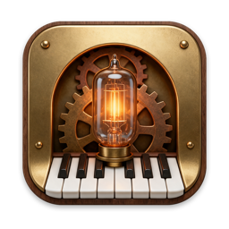
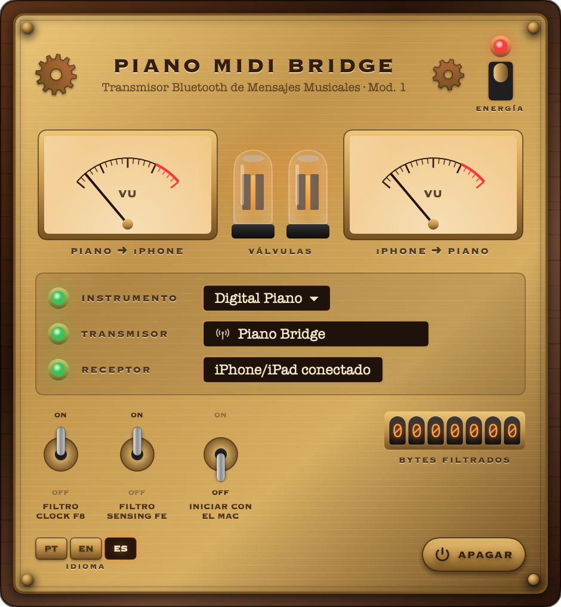
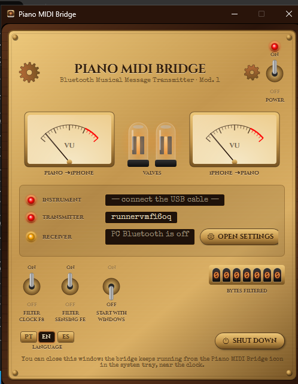

<p align="center"></p>

# 🎹 Piano MIDI Bridge

[Português](README.md) · [English](README.en.md) · **Español**

Use **Smart Pianist** (o cualquier otra app MIDI del iPhone/iPad) con un piano digital conectado **al Mac por USB**, sin comprar un adaptador Bluetooth MIDI (p. ej., Yamaha UD-BT01).

El Mac se convierte en el "adaptador Bluetooth MIDI": la app anuncia el Mac como dispositivo Bluetooth MIDI (sin la ventana de configuración de macOS), el iPhone se conecta a él y la app reenvía los mensajes MIDI entre el iPhone y el piano USB en ambos sentidos (notas, pedales, comandos y SysEx).

```
iPhone (Smart Pianist) ──Bluetooth MIDI──▶ Mac (Piano MIDI Bridge) ──USB──▶ Piano
```

<p align="center"></p>

Probado con un **Yamaha P-145BT** + Smart Pianist en iPhone. Debería funcionar con cualquier instrumento USB-MIDI class-compliant.

> Proyecto independiente, sin relación con Yamaha. "Yamaha", "Smart Pianist" y "UD-BT01" son marcas de sus respectivos dueños.

## 🪟 Windows (beta)

También hay una versión para **Windows 10 (2004+) y Windows 11**, con el mismo panel y los mismos tres idiomas.

1. Descargue en **[Releases](../../releases)** el `PianoMIDIBridge-Setup-x.y.z-x64.exe` (o `-arm64` para PCs ARM). También hay una versión portátil `.zip`.
2. Instálelo (no pide administrador). Si SmartScreen avisa, haga clic en **Más información → Ejecutar de todas formas**.
3. Conecte el piano al PC con el cable USB y abra la app. Cerrar la ventana deja el puente activo en el icono 🎹 de la bandeja del sistema, junto al reloj.
4. En el iPhone, siga los mismos pasos de Smart Pianist descritos abajo. El PC aparece con el **nombre Bluetooth del equipo**: en Windows no se puede elegir otro nombre.

<p align="center"></p>

Diferencias con macOS:
- El adaptador Bluetooth del PC debe admitir el modo **periférico** de Bluetooth LE. La mayoría de los adaptadores actuales lo admite; si no, el panel lo indica.
- En Windows solo un programa a la vez puede usar el piano: cierre DAWs o apps de Yamaha que lo tengan abierto.
- Registro de diagnóstico: `%LOCALAPPDATA%\PianoMidiBridge\PianoMidiBridge.log`.
- Código en [`windows/`](windows/) (C#/.NET 8, WPF). El instalador y las versiones portátiles se generan con GitHub Actions.

> **Beta:** la versión para Windows está compilada y probada automáticamente (códec Bluetooth MIDI e interfaz), pero aún no se ha probado con un piano y un iPhone reales. Los informes son bienvenidos en [Issues](../../issues).

## Requisitos (macOS)

- macOS 14 (Sonoma) o posterior, Apple Silicon o Intel
- Mac con Bluetooth
- Piano conectado al Mac con cable USB (puerto **USB TO HOST** del piano)

## Instalación (macOS)

1. Descargue `PianoMIDIBridge-x.y.z.dmg` en **[Releases](../../releases)**.
2. Abra el DMG y arrastre **Piano MIDI Bridge** a **Aplicaciones**.
3. **Primera apertura:** la app no está firmada con un certificado de Apple, así que macOS la bloqueará:
   - Abra la app una vez (aparecerá un aviso) y cierre el aviso.
   - Vaya a **Ajustes del Sistema → Privacidad y seguridad**, desplácese hasta el final y haga clic en **Abrir igualmente**.
   - O, desde la Terminal:
     ```bash
     xattr -dr com.apple.quarantine "/Applications/Piano MIDI Bridge.app"
     ```
4. Al abrirla aparece el panel de la app. Puede cerrarlo: el puente sigue funcionando desde el icono 🎹 de la **barra de menús** (la app no queda en el Dock). Para ver el panel de nuevo, abra la app otra vez o haga clic en 🎹.

## Cómo usar

1. Conecte el piano al Mac con el cable USB.
2. Abra la app. La primera vez, macOS pide permiso de **Bluetooth**: haga clic en **Permitir**.
3. Revise el panel: **INSTRUMENTO** en verde con el nombre del piano y **TRANSMISOR** en verde con el nombre anunciado (por defecto `Piano Bridge`; haga clic en el nombre para cambiarlo).
4. En el iPhone, en **Smart Pianist**:
   1. Toque el icono de conexión (arriba a la izquierda) → **Start Connection Wizard**.
   2. **Next** → **Bluetooth** → **Yes** → **Yes** → **Next**.
   3. Toque **Connect Bluetooth MIDI Device**, elija `Piano Bridge` (si el Mac ya se usó antes como dispositivo Bluetooth MIDI, el iPhone puede mostrar su nombre anterior) y toque ✓.
   4. **Next** → elija su piano en la lista (p. ej., `P-145BT`).
   - ⚠️ No lo empareje desde Ajustes → Bluetooth del iPhone; conéctese **desde dentro de la app**.
5. La lámpara de **RECEPTOR** se pone verde y el icono del instrumento se pone verde en Smart Pianist. ¡Listo!

Las próximas veces, basta con abrir la app en el Mac: Smart Pianist se reconecta solo.

### El panel

| Control | Qué hace |
|---|---|
| Interruptor **ENERGÍA** (arriba a la derecha) | Enciende/apaga el puente |
| **Vúmetros** | Tráfico MIDI en cada sentido: piano → iPhone e iPhone → piano |
| **Válvulas** | Se encienden con el puente activo y brillan más con el tráfico |
| **INSTRUMENTO** | Elige el piano USB (haga clic en el nombre) |
| **TRANSMISOR** | Nombre que ve el iPhone (haga clic para editarlo). Lámpara verde = anunciando; roja = Bluetooth del Mac apagado o no permitido |
| **RECEPTOR** | Muestra el iPhone/iPad conectado por Bluetooth |
| **FILTRO CLOCK F8** | No envía el reloj MIDI del piano al iPhone. Recomendado: el reloj genera decenas de mensajes por segundo y puede cortar la conexión Bluetooth |
| **FILTRO SENSING FE** | No envía el active sensing ("estoy vivo") del piano. Recomendado por el mismo motivo |
| **INICIAR CON EL MAC** | Abre la app automáticamente al iniciar sesión |
| Contador Nixie | Total de bytes filtrados |
| **IDIOMA** | Portugués, inglés o español (empieza en el idioma del sistema) |
| **APAGAR** | Cierra la app |

## Problemas comunes

- **El piano no aparece:** revise el cable (debe ser de datos) y el puerto USB TO HOST. Debe aparecer en *Configuración de Audio MIDI*.
- **Smart Pianist dice que quiere usar Bluetooth "para nuevas conexiones" y no encuentra el Mac:** el Bluetooth del iPhone se apagó desde el Centro de control, lo que bloquea dispositivos nuevos hasta el día siguiente. Vaya a **Ajustes → Bluetooth** en el iPhone y active el interruptor.
- **El iPhone no encuentra el Mac:** compruebe que **TRANSMISOR** está en verde en el panel. Cierre y vuelva a abrir Smart Pianist. El iPhone puede mostrar el nombre anterior del Mac en lugar de `Piano Bridge`.
- **TRANSMISOR en rojo:** encienda el Bluetooth del Mac o permita el Bluetooth para la app en **Ajustes del Sistema → Privacidad y seguridad → Bluetooth** (el panel tiene un botón **ABRIR AJUSTES**).
- **Para reportar un problema:** adjunte el archivo `~/Library/Logs/Piano MIDI Bridge.log`.
- **La conexión se corta:** deje ambos filtros activados y mantenga el iPhone cerca del Mac.
- **La app conecta pero no reconoce el piano:** apague y encienda el puente con el interruptor ENERGÍA y vuelva a conectar desde la app.

## Compilar desde el código

Solo se necesitan las Command Line Tools (`xcode-select --install`), no Xcode completo.

```bash
./build.sh                 # genera build/Piano MIDI Bridge.app y build/PianoMIDIBridge-<versión>.dmg
VERSION=1.2.0 ./build.sh   # otra versión
```

Con un certificado Developer ID, defina `DEVELOPER_ID="Developer ID Application: Su Nombre (TEAMID)"` para firmar correctamente.

### Estructura

```
Sources/MIDIBridge.swift   motor CoreMIDI: detecta puertos, reenvía y filtra mensajes
Sources/BLEMIDIPeripheral.swift  transmisor Bluetooth LE MIDI integrado (anuncio, codificación BLE MIDI)
Sources/DiagLog.swift      registro de diagnóstico en ~/Library/Logs
Sources/App.swift          app, ventana e icono de la barra de menús
Sources/SteampunkUI.swift  panel steampunk: válvulas, vúmetros, interruptores, Nixie
Sources/Strings.swift      textos de la interfaz en portugués, inglés y español
Resources/Info.plist       metadatos de la app
Resources/AppIcon.png      icono maestro de 1024 px (generado con IA y recortado por scripts/make-icon-master.swift)
build.sh                   compila, arma la .app, firma y crea el .dmg
```

Cómo funciona: la app anuncia el Mac como dispositivo Bluetooth LE MIDI mediante CoreBluetooth, y eso es lo que hace que el Mac aparezca en el iPhone sin la ventana de configuración de macOS. Cuando el iPhone se conecta, normalmente el propio driver Bluetooth MIDI de macOS asume la sesión (crea el puerto "<nombre del Mac> Bluetooth") y la app reenvía todo entre ese puerto y el piano USB. Si el iPhone usa el servicio de la app, la propia app codifica y decodifica el BLE MIDI. En ambos casos, todo lo que llega de un lado se reenvía al otro. Los bytes de tiempo real `F8`/`FE` se eliminan solo en el sentido piano → iPhone, cuando los filtros están activados.

## Licencia

MIT. Vea [LICENSE](LICENSE).
