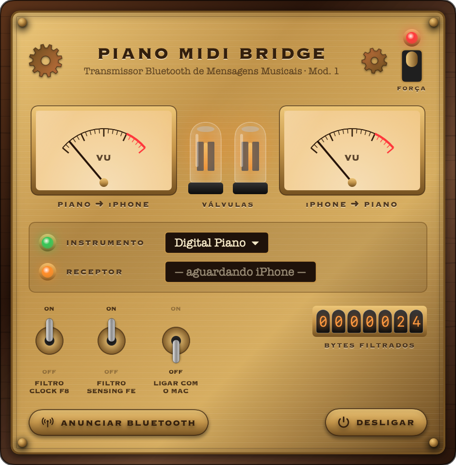

<p align="center"></p>

# 🎹 Piano MIDI Bridge

**Português** · [English](README.en.md) · [Español](README.es.md)

Use o **Smart Pianist** (ou outro app MIDI do iPhone/iPad) com um piano digital ligado **por USB ao Mac**, sem comprar o adaptador Bluetooth MIDI (ex.: Yamaha UD-BT01).

O Mac vira um "adaptador Bluetooth MIDI": o app anuncia o Mac como dispositivo Bluetooth MIDI (sem precisar da janela de configuração do macOS), o iPhone se conecta a ele e o app repassa as mensagens MIDI entre o iPhone e o piano USB, nos dois sentidos (notas, pedais, comandos e SysEx).

```
iPhone (Smart Pianist) ──Bluetooth MIDI──▶ Mac (Piano MIDI Bridge) ──USB──▶ Piano
```

<p align="center"></p>

Testado com **Yamaha P-145BT** + Smart Pianist no iPhone. Deve funcionar com qualquer instrumento USB-MIDI class-compliant.

> Projeto independente, sem vínculo com a Yamaha. "Yamaha", "Smart Pianist" e "UD-BT01" são marcas de seus respectivos donos.

## Requisitos

- macOS 14 (Sonoma) ou mais novo, Apple Silicon ou Intel
- Mac com Bluetooth
- Piano ligado ao Mac por cabo USB (porta **USB TO HOST** do piano)

## Instalação

1. Baixe o `PianoMIDIBridge-x.y.z.dmg` em **[Releases](../../releases)**.
2. Abra o DMG e arraste **Piano MIDI Bridge** para **Aplicativos**.
3. **Primeira abertura:** o app não é assinado com certificado da Apple, então o macOS vai bloquear:
   - Abra o app uma vez (vai aparecer o aviso) e feche o aviso.
   - Vá em **Ajustes do Sistema → Privacidade e Segurança**, role até o fim e clique em **Abrir Mesmo Assim**.
   - Ou, pelo Terminal:
     ```bash
     xattr -dr com.apple.quarantine "/Applications/Piano MIDI Bridge.app"
     ```
4. Ao abrir, aparece o painel do app. Pode fechá-lo: a ponte continua rodando no ícone 🎹 da **barra de menus** (o app não fica no Dock). Para ver o painel de novo, abra o app outra vez ou clique no 🎹.

## Como usar

1. Ligue o piano no Mac pelo cabo USB.
2. Abra o app. Na primeira vez o macOS pede permissão de **Bluetooth**: clique em **Permitir**.
3. Confira o painel: **INSTRUMENTO** verde com o nome do piano e **TRANSMISSOR** verde com o nome anunciado (padrão `Piano Bridge`; clique no nome para trocar).
4. No iPhone, no **Smart Pianist**:
   1. Toque no ícone de conexão (canto superior esquerdo) → **Start Connection Wizard**.
   2. **Next** → **Bluetooth** → **Yes** → **Yes** → **Next**.
   3. Toque em **Connect Bluetooth MIDI Device**, escolha `Piano Bridge` (se o Mac já foi usado como dispositivo Bluetooth MIDI antes, o iPhone pode mostrar o nome antigo) e toque em ✓.
   4. **Next** → escolha o seu piano na lista (ex.: `P-145BT`).
   - ⚠️ Não pareie pelos Ajustes → Bluetooth do iPhone; conecte **por dentro do app**.
5. A lâmpada de **RECEPTOR** fica verde e o ícone do instrumento fica verde no Smart Pianist. Pronto!

Nas próximas vezes, basta abrir o app no Mac: o Smart Pianist reconecta sozinho.

### O painel

| Controle | O que faz |
|---|---|
| Chave **FORÇA** (canto superior direito) | Liga/desliga a ponte |
| **VU meters** | Tráfego MIDI em cada sentido: piano → iPhone e iPhone → piano |
| **Válvulas** | Acendem com a ponte ligada e brilham mais com o tráfego |
| **INSTRUMENTO** | Escolhe o piano USB (clique no nome) |
| **TRANSMISSOR** | Nome que o iPhone vê (clique para editar). Lâmpada verde = anunciando; vermelha = Bluetooth do Mac desligado ou não permitido |
| **RECEPTOR** | Mostra o iPhone/iPad conectado por Bluetooth |
| **FILTRO CLOCK F8** | Não envia o clock do piano ao iPhone. Recomendado: o clock gera dezenas de mensagens por segundo e pode derrubar a conexão Bluetooth |
| **FILTRO SENSING FE** | Não envia o "estou vivo" (active sensing) do piano. Recomendado pelo mesmo motivo |
| **LIGAR COM O MAC** | Inicia o app automaticamente no login |
| Contador Nixie | Total de bytes filtrados |
| **IDIOMA** | Português, inglês ou espanhol (começa no idioma do sistema) |
| **DESLIGAR** | Encerra o app |

## Problemas comuns

- **O piano não aparece:** confira o cabo (tem que ser de dados) e a porta USB TO HOST. Ele deve aparecer em *Configuração de Áudio e MIDI*.
- **O Smart Pianist diz que quer usar Bluetooth "para novas conexões" e não acha o Mac:** o Bluetooth do iPhone foi desligado pela Central de Controle, o que bloqueia aparelhos novos até o dia seguinte. Vá em **Ajustes → Bluetooth** no iPhone e ligue a chave.
- **O iPhone não encontra o Mac:** confira se o **TRANSMISSOR** está verde no painel. Feche e reabra o Smart Pianist. O iPhone pode mostrar o nome antigo do Mac em vez de `Piano Bridge`.
- **TRANSMISSOR vermelho:** ligue o Bluetooth do Mac ou permita o Bluetooth para o app em **Ajustes do Sistema → Privacidade e Segurança → Bluetooth** (o painel tem um botão **ABRIR AJUSTES**).
- **Para reportar um problema:** anexe o arquivo `~/Library/Logs/Piano MIDI Bridge.log`.
- **A conexão cai:** deixe os dois filtros ligados e mantenha o iPhone perto do Mac.
- **O app conecta, mas não reconhece o piano:** desligue e ligue a ponte pelo interruptor e reconecte pelo app.

## Compilar a partir do código

Precisa só das Command Line Tools (`xcode-select --install`), não do Xcode completo.

```bash
./build.sh                 # gera build/Piano MIDI Bridge.app e build/PianoMIDIBridge-<versão>.dmg
VERSION=1.2.0 ./build.sh   # outra versão
```

Com um certificado Developer ID, defina `DEVELOPER_ID="Developer ID Application: Seu Nome (TEAMID)"` para assinar de verdade.

### Estrutura

```
Sources/MIDIBridge.swift   motor CoreMIDI: detecta portas, repassa e filtra mensagens
Sources/BLEMIDIPeripheral.swift  transmissor Bluetooth LE MIDI embutido (anúncio, codificação BLE MIDI)
Sources/DiagLog.swift      log de diagnóstico em ~/Library/Logs
Sources/App.swift          app, janela e ícone da barra de menus
Sources/SteampunkUI.swift  painel steampunk: válvulas, VU meters, chaves, Nixie
Resources/Info.plist       metadados do app
scripts/make-icon.swift    gera o ícone
build.sh                   compila, monta o .app, assina e cria o .dmg
```

Como funciona: o app anuncia o Mac como dispositivo Bluetooth LE MIDI pelo CoreBluetooth, e é isso que faz o Mac aparecer no iPhone sem a janela de configuração do macOS. Quando o iPhone conecta, normalmente é o driver Bluetooth MIDI do próprio macOS que assume a sessão (ele cria a porta "<nome do Mac> Bluetooth"), e o app repassa tudo entre essa porta e o piano USB. Se o iPhone usar o serviço do app, o próprio app codifica e decodifica o BLE MIDI. Nos dois casos, tudo que chega de um lado é reenviado ao outro. Os bytes de tempo real `F8`/`FE` são removidos só no sentido piano → iPhone, quando os filtros estão ligados.

## Licença

MIT. Veja [LICENSE](LICENSE).
